# 🧠 Proyecto MLOps - Predicción de Readmisión en Pacientes con Diabetes
## 1. 🎯 Introducción
Este proyecto tiene como objetivo construir una plataforma completa de MLOps que permita:

- Procesar y transformar datos clínicos con Apache Airflow.
- Entrenar y registrar un modelo predictivo con MLflow.
- Almacenar artefactos del modelo en MinIO.
- Desplegar una API de inferencia con FastAPI.
- Exponer métricas de inferencia a Prometheus.
- Visualizar el comportamiento del sistema en Grafana.
- Hacer pruebas de carga con Locust.
- Exponer el API con una interfaz de usuario Streamlit.

**El caso de uso se centra en la predicción de readmisión hospitalaria en pacientes con diabetes, utilizando el dataset público Diabetes 130-US hospitals.**

## 2. 🗂 Estructura de Archivos Principales

```
dags/
 ├── raw_to_clean_and_transform.py         # DAG ETL que limpia y transforma los datos
 ├── train_and_register.py                 # DAG que entrena el modelo y lo registra en MLflow

k8s/
 ├── airflow/                              # Despliegue de Airflow (deployment, jobs y servicios)
 ├── common/                               # Archivos comunes (PostgreSQL, MinIO)
 ├── inference-api/                        # Dockerfile e implementación de la API de inferencia
 ├── minio/                                # Archivos de despliegue para el servicio MinIO
 ├── mlflow/                               # Archivos de despliegue de MLflow y su servicio
 ├── observability/                        # Configuraciones de Prometheus y Grafana
 └── namespace.yml                         # Define el namespace del proyecto

recreate_all.sh                            # Despliegue completo desde cero
run_pipelines.sh                           # Corre los DAGs en secuencia
observabilidad.sh                          # Script para desplegar Prometheus, Grafana y API
```

## 3. 🛠 Airflow

- 📍 URL: http://localhost:8080

- 📦 DAGs implementados:

**raw_to_clean_and_transform.py**
Descarga los datos originales, los divide en train/val/test, los limpia y transforma.
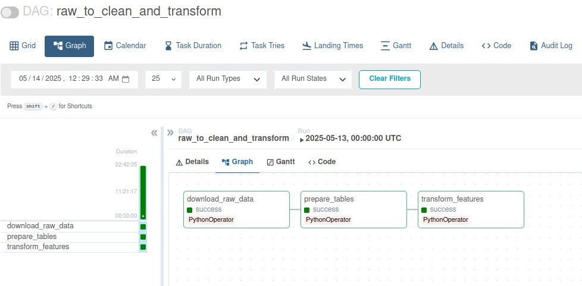

**train_and_register.py**
Carga los datos desde Postgres, realiza un gridsearch manual con XGBoost, registra el mejor modelo en MLflow y lo pone en producción.

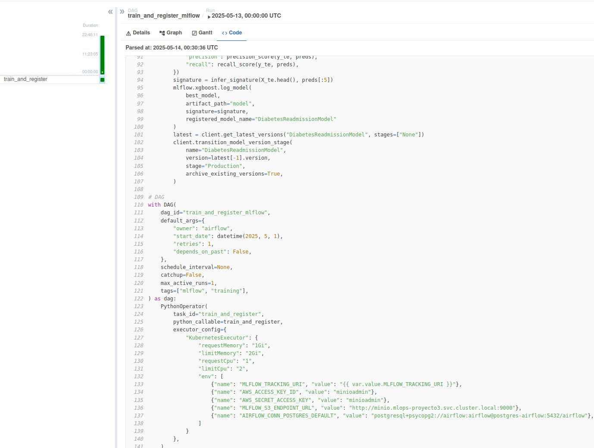

#### Detalle Modelo:
Inicialmente se exploraron las caracterìsticas que tienen valores ? como missing o null, para evitar que el modelo los vea como string se imputaron por NaN

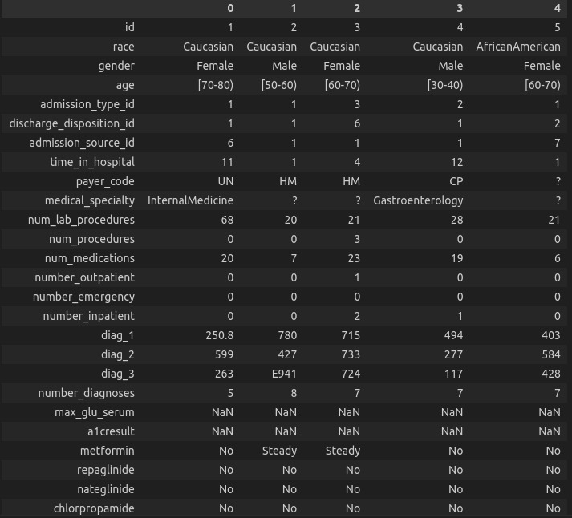

Las variables con valores NaN se eliminaron del modelo
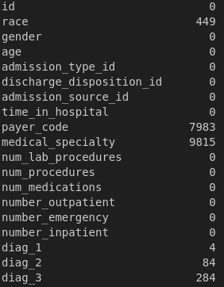

La edad se imputo con la mediana del intervalo
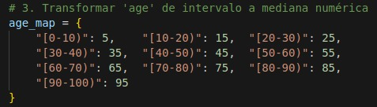

Se revisaron las correlaciones para simplificar las caracterìsticas a variables no tan correlacionadas entre si.
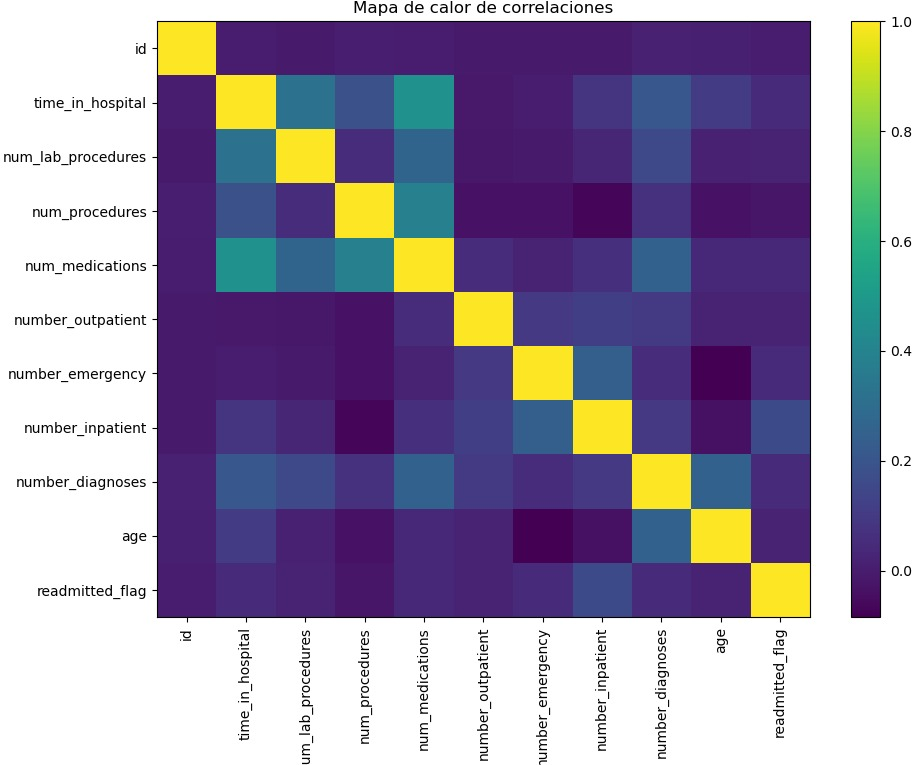

Se utilizò f1 como metrica dado el desbalance de las clases
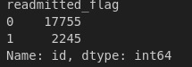

## 4. 📦 MLflow
- 📍 URL: http://localhost:5000
- Se usa como servidor de tracking.
- Registra parámetros, métricas, artefactos y versiones del modelo.
- El modelo se despliega en stage Production bajo el nombre "DiabetesReadmissionModel".

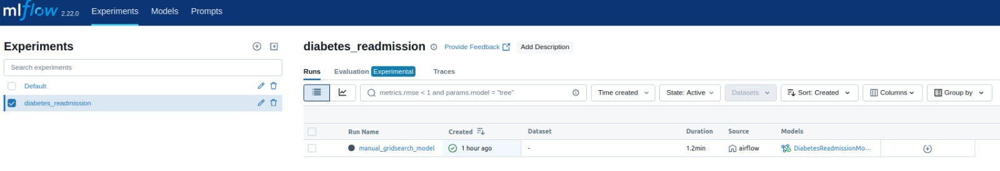

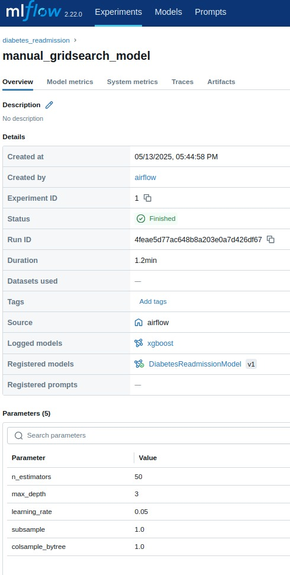

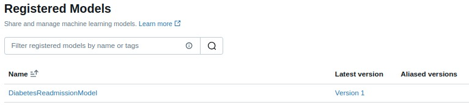

## 5. 🗄 MINIO

MinIO simula un servicio S3 local.
Se utiliza para almacenar los artefactos del modelo exportados desde MLflow.

📁 Bucket creado: mlflow

**Credenciales por defecto:**

*AWS_ACCESS_KEY_ID=minioadmin*
*AWS_SECRET_ACCESS_KEY=minioadmin*

## 6. 🧪 Prueba de la API con curl

curl -X POST http://localhost:8081/predict \
  -H "Content-Type: application/json" \
  -d '{"instances":[{"time_in_hospital":3,"num_lab_procedures":45,"num_procedures":0,"num_medications":10,"number_outpatient":0,"number_emergency":0,"number_inpatient":1,"number_diagnoses":9,"age":60}]}'

**Output Esperado: {"predictions":[1]}**

**📍 La API responde en http://localhost:8081.**

## 7. 📈 Despliegue de Prometheus

**📍 URL: http://localhost:9090**

**Configurado para raspar métricas de:**
- inference-api.mlops-proyecto3.svc.cluster.local:80
- prometheus.mlops-proyecto3.svc.cluster.local:9090 (automonitoreo)

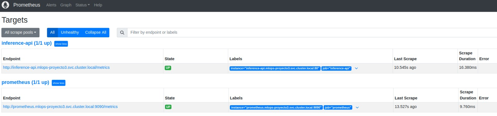

**Métricas recolectadas:**
- inference_requests_total
- inference_request_latency_seconds

## 8. 📊 Despliegue de Grafana

**📍 URL: http://localhost:3000**

*Usuario: admin, Contraseña: admin*

**Datasource configurado: Prometheus**

**Dashboard cargado automáticamente desde un ConfigMap, visualiza:**
- Total de inferencias
- Latencia media
- Inferencias por estado (success / error)

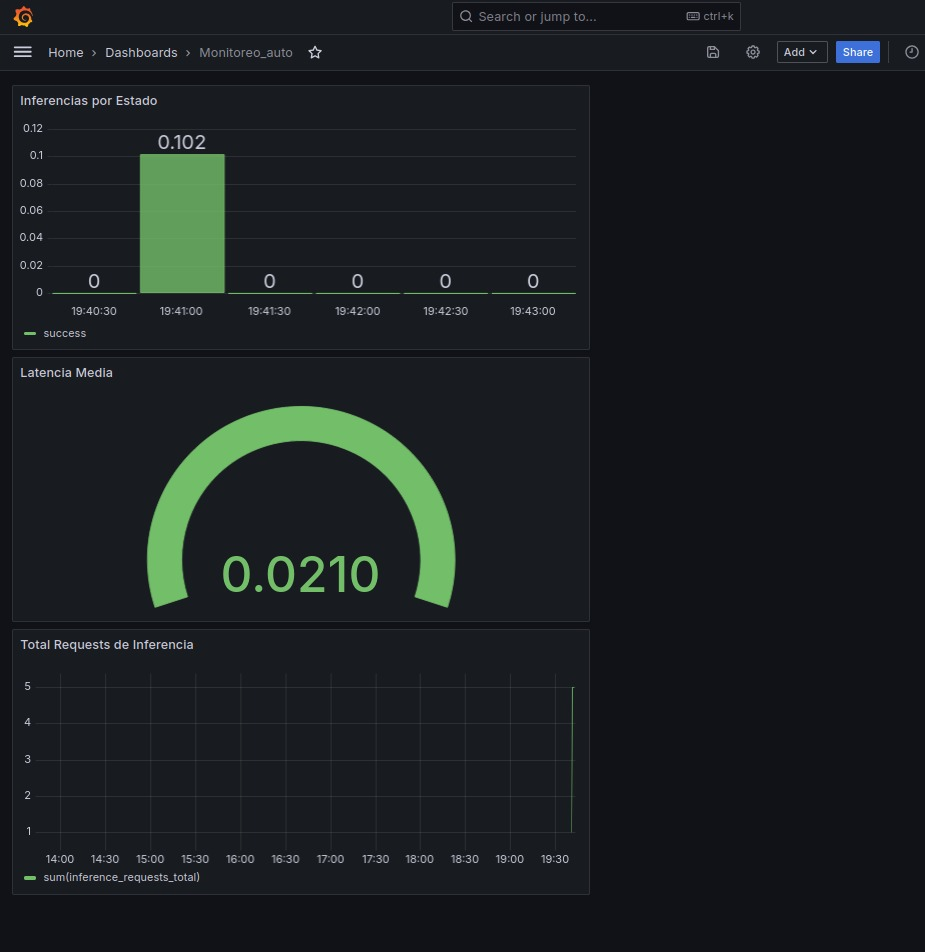

## 9. 📊 Streamlit


## Acceso a la interfaz de Streamlit

La interfaz de usuario de Streamlit estará disponible en:

http://<IP_DE_MINIKUBE>:<NODEPORT>

Por ejemplo, si tu IP de Minikube es `192.168.49.2` y el puerto asignado es `30433`:

http://192.168.49.2:30433

> **Nota:** Esta URL solo es accesible desde tu máquina local o red donde corre Minikube.

Para obtener la IP de Minikube:
```bash
minikube ip
```

Para obtener el NodePort asignado:
```bash
kubectl get svc -n mlops-proyecto3 streamlit-ui-service
```
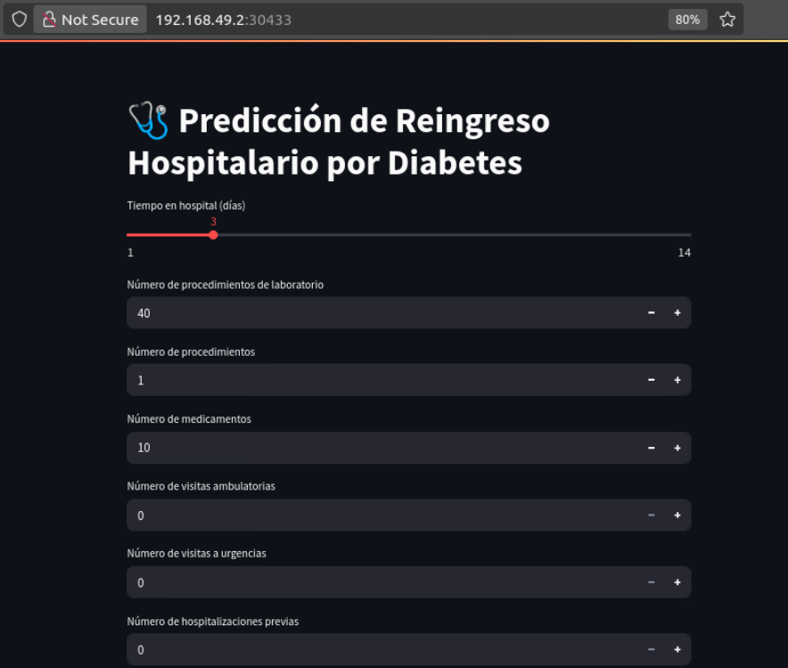

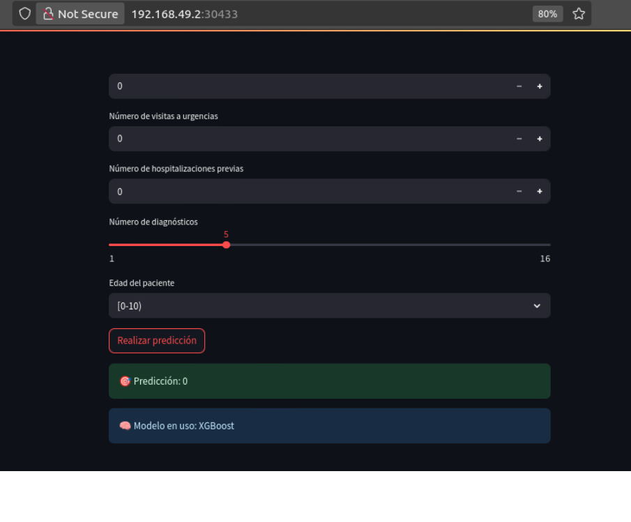
